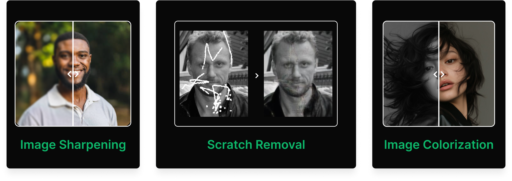
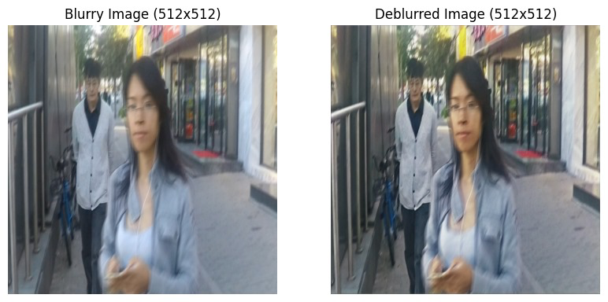
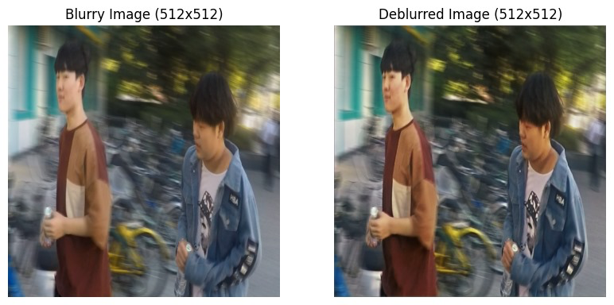
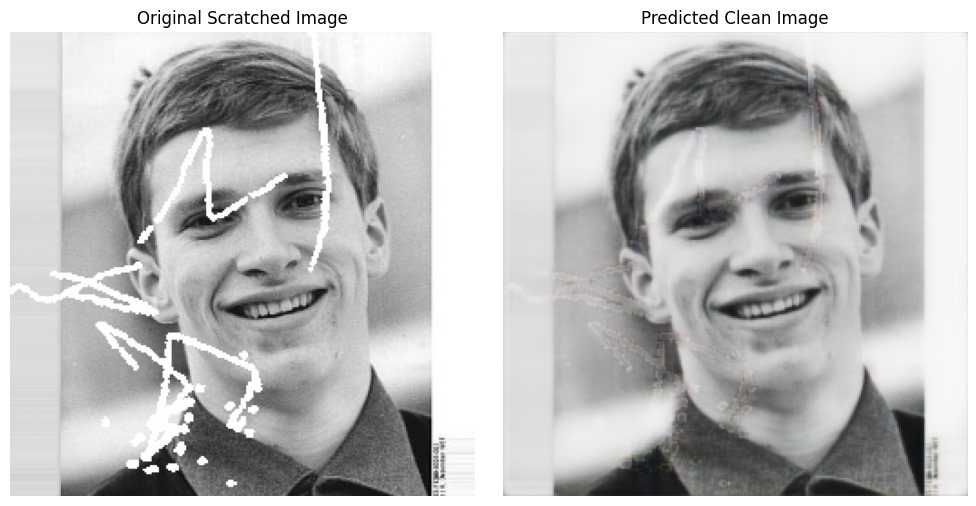
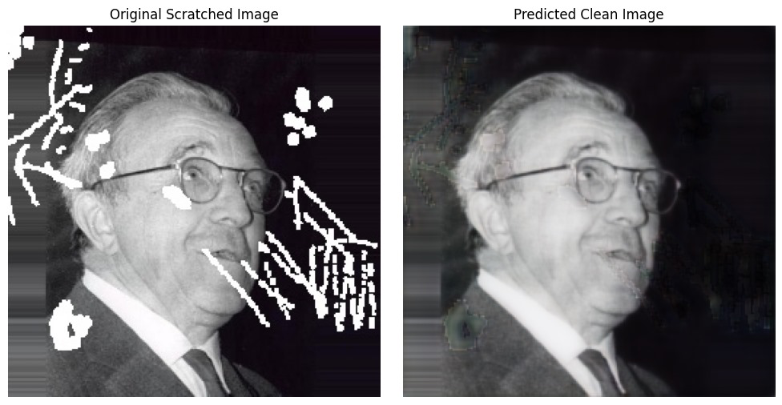

# ReviveAI ✨


<p align="center">
  
<p align="center">
  <em>Restore your memories. AI-powered image deblurring, sharpening, and scratch removal.</em>
</p>

<p align="center">
  <!-- Badges: Replace placeholders with actual links/info -->
  <a href="#"></a>
  <a href="link/to/your/LICENSE"></a> <!-- Choose your license -->
  <a href="#"></a>
  <a href="link/to/your/contributing/guide"></a>
  <!-- Add more badges as needed: dependencies, code style, etc. -->
</p>

---

## 📖 About ReviveAI

ReviveAI leverages the power of Artificial Intelligence to breathe new life into your old or degraded photographs. Whether it's blurriness from camera shake, general lack of sharpness, or physical damage like scratches, ReviveAI aims to restore clarity and detail, preserving your precious moments.

This project utilizes state-of-the-art deep learning models trained specifically for image restoration tasks. Our goal is to provide an accessible tool for enhancing image quality significantly.

---

## 🔥 Key Features
<p align = "center"></p>

*   **Image Sharpening:** Enhances fine details and edges for a crisper look.
*   **Scratch Removal:** Intelligently detects and inpaints scratches and minor damages on photographs.
*   **Image Colorization:** Adds realistic color to grayscale images.

---

## ✨ Before & After Showcase

See the results of ReviveAI in action!

<p align="center"> <!-- Center align the entire table block -->

| Examples                                    | Task Performed     |
| :-----------------------------------------: | :----------------- |
|  | Image Sharpening   |
|  | Image Sharpening   |
|  | Scratch Removal    |
|  | Scratch Removal    |
</p> <!-- End of center alignment -->

---


## 🛠️ Tech Stack

The project is built using the following technologies:

<p align="left"> <!-- Or use align="center" if you prefer -->
  <a href="https://www.python.org/" target="_blank">
    
  </a> 
  <a href="https://www.tensorflow.org/" target="_blank">
    
  </a> 
  <a href="https://opencv.org/" target="_blank">
    
  </a> 
  <a href="https://numpy.org/" target="_blank">
    
  </a> 
  <!-- Add more badges here if needed for GUI, Web Frameworks, etc. -->
</p>

---


## 📊 Implementation Status

Track the development progress of ReviveAI's key features and components:

| Feature / Component          | Status                   | Notes / Remarks (Optional) |
| :--------------------------- | :----------------------- | :------------------------- |
| Image Deblurring/Sharpening  | ✅ Completed             | Core model functional      |
| Scratch Removal              | ✅ Completed             | Core model functional      |
| Image Colorization           | 🚧 In Progress           | Model integration underway |
| Website Design (UI/UX)       | ✅ Completed             | Design finalized           |
| Website Implementation       | ⌛ Pending               | Backend/Frontend dev needed|
| Website Deployment           | ⌛ Pending               | Requires server setup      |

---

## 🚀 Getting Started

Follow these steps to get ReviveAI running on your local machine.

**(Rest of the Getting Started section follows...)**

**1. Prerequisites:**

*   Python (version 3.8 or higher recommended)
*   Pip (Python package installer)
*   Git (for cloning the repository)
*   [Mention any other specific prerequisites, e.g., CUDA for GPU acceleration]

**2. Clone the Repository:**

```bash
git clone https://github.com/your-username/ReviveAI.git
cd ReviveAI
